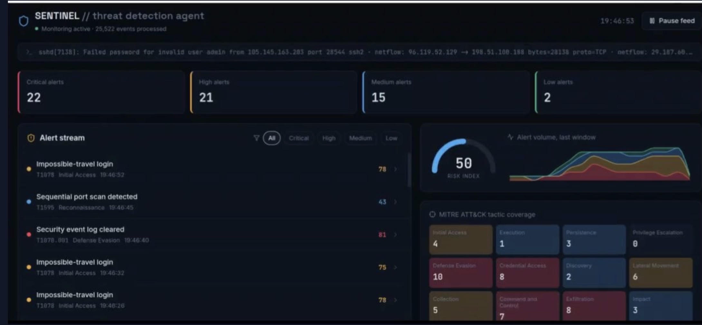

# AI Threat Detection Agent

## Overview

An AI-assisted cybersecurity threat detection dashboard designed to simulate Security Operations Center (SOC) workflows.

The application monitors simulated security events, analyzes threat severity, maps activity to MITRE ATT&CK techniques, and provides recommended mitigation steps.

## Features

- Real-time simulated security event monitoring
- Automated threat alert generation
- Risk scoring and severity classification
- MITRE ATT&CK tactic mapping
- Security incident investigation dashboard
- Recommended threat mitigation actions
- Interactive SOC-style interface

## Technologies Used

- React.js
- JavaScript (JSX)
- Recharts
- Lucide React
- AI-assisted development tools

## Cybersecurity Concepts Demonstrated

- Threat detection
- Incident response workflows
- Security Operations Center (SOC) monitoring
- Risk assessment
- MITRE ATT&CK framework
- Security event analysis

## Future Improvements

- Connect to real security logs
- Integrate with SIEM platforms
- Add machine learning threat classification
- Implement real-time API monitoring
## Preview

## Future Improvements

- Connect to real security logs
- Integrate with SIEM platforms
- Add machine learning-based anomaly detection
- Include real-time network monitoring
- Add automated incident response actions
